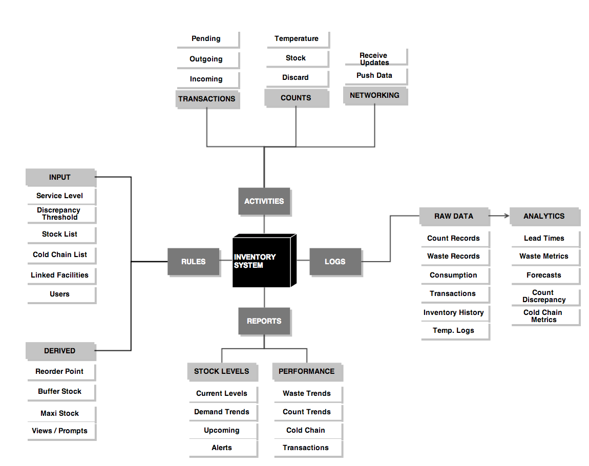
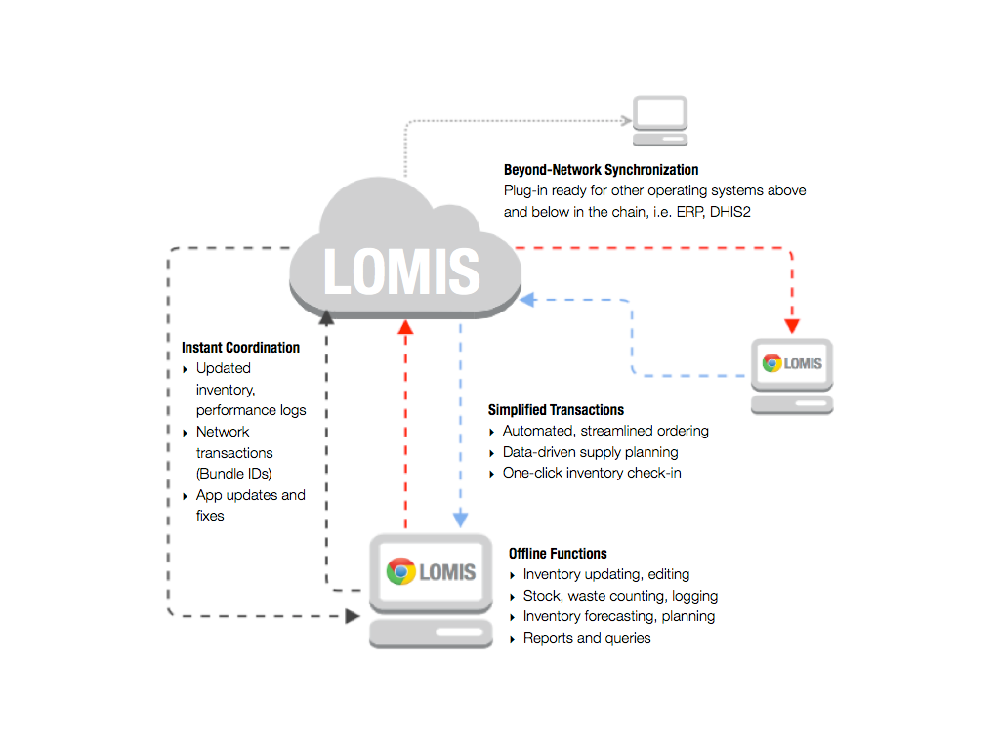

=========
Structure
=========

Inventory System
----------------
Each facility in the network is given an inventory system that governs how the individual components of
LOMIS interact locally. It is a system of rules, activities, logs and reports. Rules can be manually determined
and, or programmatically derived and updated from the activities of the facility over time. The activities of the
facility are logged to update inventory levels and facility performance metrics, feed the analytics that initiate
workflows, updates rules, and drive reporting functions that present the appropriate users the most relevant
and urgent information about the facility. This processing occurs first at the local client level on or offline.
When a connection is available, select data from each facility are pushed to the network and updates are
pushed down to the applications.

Chrome Application
------------------
The LOMIS App enables a complete set of inventory management functions without an internet connection.
When a connection is available, the App automatically synchs with the central server and the other facilities in
its network.

