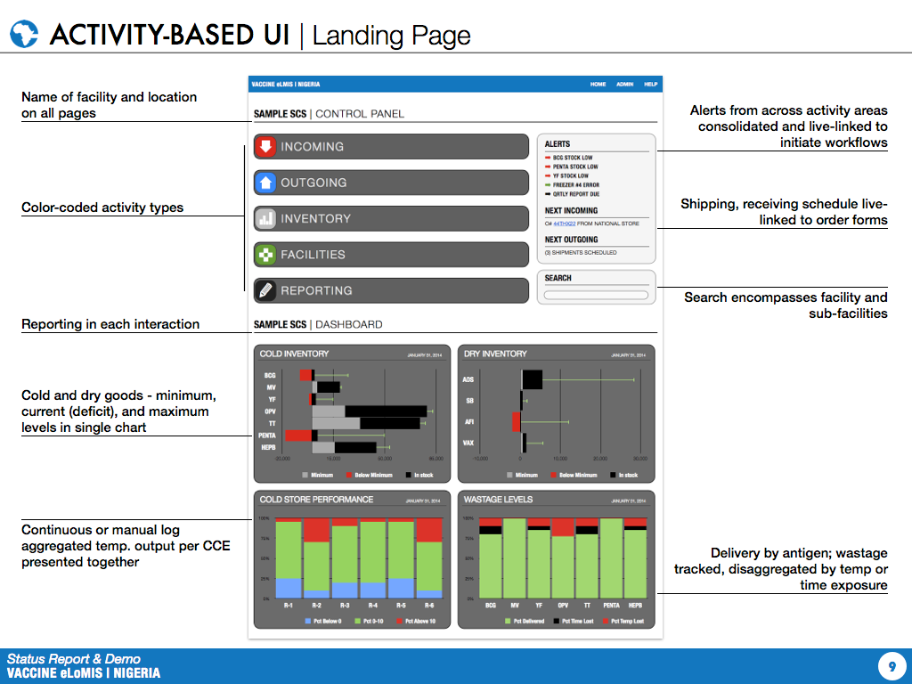
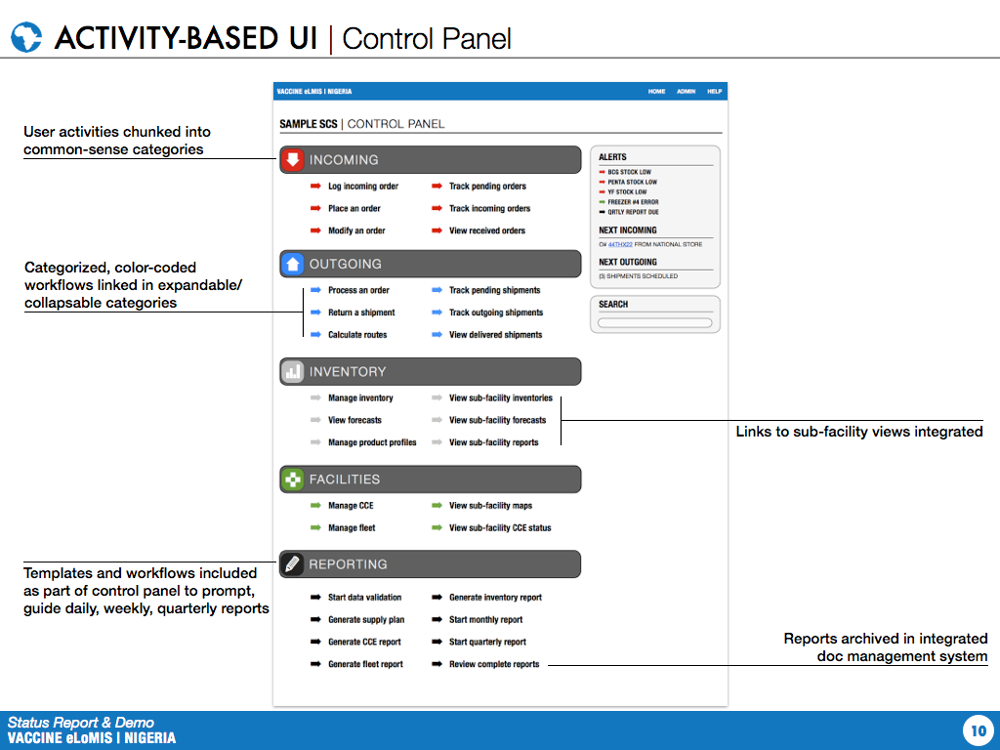
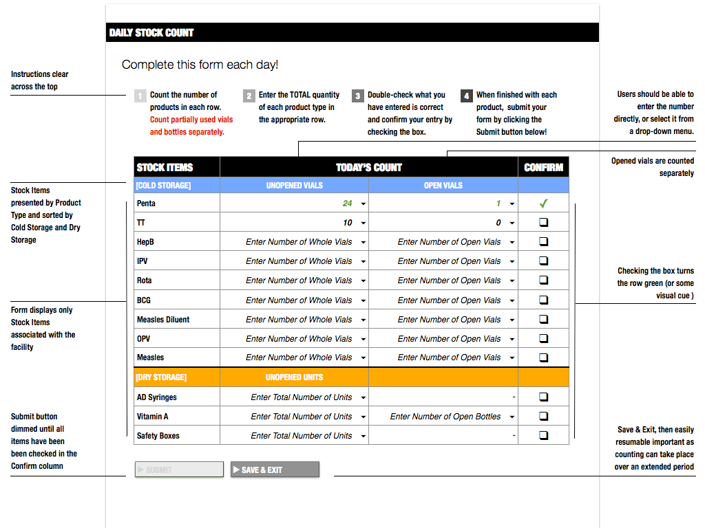
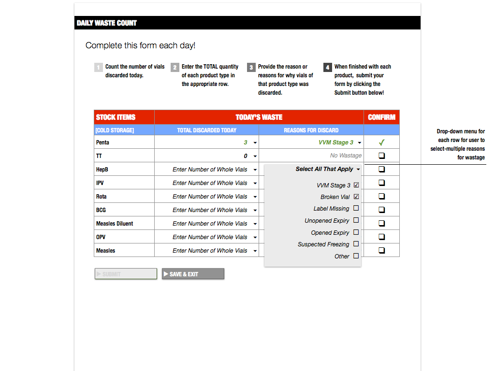

User Interfaces
===============

General
-------

**# HEADER** | Headers appear on each page of the Chrome app. In the Android version header options are
collapsable and disappearing on each view. The header links back to the user’s profile, the landing page,
calendar, and help menu.

Landing Page
------------

Daily Counts
------------

Inventory
---------

**# STOCK ITEM DASHBOARD** | From the Inventory link on the landing page, the user is presented with the
facility stock list. Clicking on a stock item reveals an item dashboard that presents the most urgent and
relevant information for the particular user profile. The dashboard presents the current stock level (in doses),
summary performance statistics, including lead-time consumption, buffer stock level, and reorder point. If the
user is an administrator, the option to manage the inventory rules (maximum level, service level) is presented
here. The stock-item dashboard also shows (a) past month consumption v. inventory level chart and (b)
wastage rates for the past month specific to the item.

**# INVENTORY OVERVIEW** | Users are within two clicks of viewing their facility’s actual, on-hand inventory
and the inventories of the facilities linked to them up and down the supply chain. The Actual Inventory views
present the on-hand delivery relative to the Reorder Point and Maximum levels assigned to the facility by
each product profile. Stock that has been ordered or is scheduled to ship is reflected as pending. In
instances of antigen with multiple profiles, levels are grouped together by Product Type. This view includes
the date/time of most recent update and date of the most recent physical stock count.

**# STOCK BALANCE TABLE** | Users can view the inventory consumption patterns of her/his facility and the
facilities linked to them by various time-windows, e.g., daily, weekly, monthly.

**# LEAD TIME LOG** | Us

**# STOCK COUNT LOG** | Us

**# DISCARD LOG** | Us

View CCU
--------

**# PERFORMANCE** |

**# CAPACITY** |

**# STATUS** |

View Map
--------

**# NETWORK** |

**# FACILITY** |

View Calendar
-------------

**# REPORTS** |

**# TRANSACTIONS** |

**# EXPIRATIONS** |

**# PROGRAM SCHEDULES** |