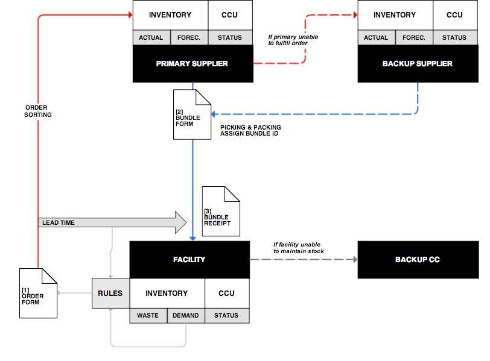

=========
Workflows
=========

Initiate Order
--------------
**# MANUAL** | A child (receiving) facility manually (ad hoc) initiates and specifies the details of a new order.
When making an order, the user specifies for which program the order is.

A parent (fulfilling) facility initiates a new order on behalf of a child (receiving) facility. This may be necessary
when the child facility has not ordered/received new supplies recently, a child facility does not have regular
access to the network, or program decision changes the supply plan fundamentals. See “Manual Pull”. ::

    If user selects ‘Make Order’
        Prompt ‘Routine or SIA’
    Initiate Order_Form

**# AUTOMATED** | A child (receiving) facility is prompted to submit a new order. Acknowledging the prompt
initiates the Order Form. The prompt schedule can be based on either (a) defined time intervals or (b) stock
level requirements - derived from stock on hand, catchment population, program plans, consumption
patterns, cold chain capacity and adequacy, and neighboring facility status.
A parent (fulfilling) facility may automate the push process for its child facilities. When a user at the parent
facility acknowledges the prompt, the user reviews and confirms a pre-populated Order Request Form. The
push-prompt schedule for each distinct facility can be based on either (a) defined intervals or (b) inventory
rules - derived from stock on hand at both parent and child facilities, child catchment population, program
plans, consumption patterns, cold chain capacity and adequacy, and neighboring facility status. ::

    (a) Scheduled
        If [today] >= [last_Order] + [interval]
            Initiate Order_Prompt

    (b) Tripped
        For Facility_Stocklist (item) do
            If item_Actual <= item_ROP
                Initiate Order_Prompt

Completing An Order Form
------------------------
**# MANUAL** | The Order Form guides the user through a standardized ordering process. The user selects
from a menu how many of which types of supplies the facility needs. The Order Form screen displays a
summary of recent orders and suggests which complementary products may also be necessary (e.g.,
diluents for lyophilized measles). The bundle of selected goods constitutes a distinct order, which receives a
unique Order Number. With final confirmation, the order enters the system, where by WiFi or SMS notification
it is sent to the matrix of eligible parent (fulfilling) facilities. The user receives a notification the order has been
assigned and received at a parent facility. The ordered quantity enters the facility inventory as pending stock;
the order appears in the “Pending Orders” section. ::

    For Facility_Stocklist (item) do
        Set Order_Form (item_qty)
        = 0
    Assign Order_Number
    Request user edits

**# AUTOMATED** | The prompted Order Form is pre-populated with the number and type of supplies
calculated to be necessary to return the facility inventory to minimum compliance; these values remain
editable for the user to adjust before confirming. With final confirmation, the order enters the system, where
by WiFi or SMS notification it is sent to the matrix of eligible parent (fulfilling) facilities. The user receives a
notification the order has been assigned and received at a parent facility. The ordered quantity enters the
facility inventory as pending stock; the order appears in the “Pending Orders” section. ::

    For Stocklist (item)

    If item_Actual <= item_ROP
        Set Order_Form (item_qty)
        = [item_Full - item_Actual]

    If item_Actual <= [item_ROP+Average LTC]
        Set Order_Form (item_qty)
        = [item_Full - item_Actual]

    Assign Order_Number
    Create Alert
    On click: pre-populated Order_Form
    Request user edits

**# SUBMITTING** | If the profile of the initiating user is not associated with the receiving facility, the system
prepares the Order Request Form, in which the user specifies to which child facility it should be assigned and
selects from a menu how many of which types of supplies the facility needs and for which programs the
supplies are intended. With parent-facility confirmation, the Order Request Form is sent to the child facility for
review and confirmation. With final confirmation, the order enters the system, where by WiFi or SMS notification its
final details are sent to the the initiating parent facility. The child-facility user receives a notification the order
confirmation has been received. The ordered quantity enters the child-facility inventory as pending stock; the order
appears in the “Pending Orders” section. ::

    Request authorization
        When authorized = yes
            If user = recipient do
                Send Order Request Form to recipient admin

            If user = recipient
                Send to Routing System
                Send SMS Alert

Process An Order
----------------
**# SELECTING THE SUPPLIER** | When a child (ordering) facility authorizes an Order Form, whether by auto/
manual push/pull, the order enters an automated review process. Each child is linked to a primary parent
facility and a network of surrounding backup facilities. First, the system assesses the readiness of the primary
parent facility by searching its records to verify the virtual inventory has been reconciled with a physical stock
count in the past week and whether the count-track discrepancy (CTD) was greater than 20%. Next the
system checks the ordered quantity against the actual inventory. If the facility’s inventory is not verifiable, the
system adds the note to the notification sent to the administrator. If the inventory has been verified, and the
quantity is available, the quantity is added to the Bundle Form and virtually removed from the parent
inventory. If the requested quantity is not available or forecasted to be available within one average lead time
of the request (or some fixed interval), the order routes to the backup facilities, where this verification and
inventory search repeats. If the quantity is available from backup facilities, the system alerts the primary
parent facility administrator, who is then responsible for arranging its delivery to the ordering child facility.

*For new and authorized Order Forms that enter the system:* ::

    def Parent_#_Inventory ()
        = (item_Actual + item_LTD)

    Find Parent_1

    If Parent_1_CTD > 0.20
        Alert to Parent_admin of order

    If Parent_1_CTD =< 0.20
        Lookup Parent_1_Inventory

    For Order_Form (item)
        If Parent_1_Inventory (item ID) contains Order_Form (item ID) and
        If Parent_1_Inventory (item_qty) >= Order_Form (item_qty)
            Set Parent_1_available = true
        If Parent_1_Inventory (item_qty) < Order_Form (item_qty)
            Set Parent_1_available = false
        If Parent_1_Inventory (item) does not contain Order_Form (item)
            Set Parent_1_available = false

    For Order_Form (item)
        For {Parent_1_available (item) = true}
            Add Order_Form (item_qty) to Bundle_Form
            Remove Order_Form (item_qty) from Parent_1_Inventory (item_qty)
        If {Parent_1_available (item) = false} > 0
            Find Parent_2
            Lookup Parent_2_Inventory

            If Parent_2_Inventory (item ID) contains Order_Form (item ID) and

            If Parent_2_Inventory (item) >= Order_Form (item_qty)
                Set Parent_2_available = true

            If Parent_2_Inventory (item) does not contain Order_Form (item)
                Set Parent_2_available = false

            If Parent_2_Inventory < Order_Form (item_qty)
                Set Parent_2_available = false

            Lookup Parent_1 (admin)
            Alert Parent_1 (admin)
            [Ordered quantity is unavailable. Availability at Parent 2.]

        If Parent_2_available = false
            Alert Parent_2 (admin)
            [Ordered quantity is unavailable. Availability at Parent 2.]

**# PICKING & PACKING** | When the verification and inventory search process is complete, the details of the
order are presented to the user along with instructions for picking and packing the order. For each line item
of the order, the system informs the user which quantities of which batches to pick from which CCU (based
on next expiry). ::

    For Bundle Form ()
        Lookup CCU at parent facility
        List the ordered items assigned to each CCU
        List the ordered quantities assigned to each item
    Display Bundle Form

The user verifies he/she was able to pick and pack the requested quantity on the form by entering the batch
number (or scanning the QR) of each. If the If the whole batch is sent, the code is entered directly. If a portion
of the batch is entered, the quantity of units from the batch are specified. Products without batch numbers,
the user confirms the type and quantity. The completed package is assigned a Bundle Number that includes
record of each of the contents and fleet assignment details. Assigning the Bundle Number can be either
automated at that point or scanned from a pre-printed QR code. Both the written code and the QR code
(when available) are attached to the physical shipment for delivery to the child (receiving) facility. ::

    For Bundle Form ()
        Prompt user per ordered item
            Confirm quantity
            Enter batch number
                Type number
                QR scan
                No batch

        Prompt assign (Bundle Number)
            If Generate
                Generate UUID
                Add UUID to Bundle_Form

            If Scan
                Initialize QR scanner app
                Enter scanned ID to Bundle_Form

Log New Inventory
-----------------
Upon arrival at the receiving facility (deliveries to child facilities or returns to parent facilities) the receiving user
reviews the Bundle Form and verifies the delivered goods equal the manifest. The receiving agent (or the
delivery agent depending on hardware availability) then enters the Bundle Number by one of the following
methods (a) type the Bundle Number into the system, (b) SMS the Bundle Number to a phone number
associated with the system, (c) scan the accompanying QR code. This prompts the Bundle Receipt. To
complete the confirmation, the user signs the paper Delivery Form, which the delivery agent keeps for
records. If the Bundle Receipt differs from the delivered package, the system prompts the receiving agent to
edit the quantities accordingly. Upon confirmation, the stock associated with the Bundle Number changes
from pending to delivered in the originating facility’s inventory and from pending to actual in the receiving
facility’s inventory.

The Bundle Receipt also guides the receiving agent through assigning (installing) the new stock items to
specific cold chain or dry storage equipment units. Beside each line-item of the Bundle Form delineated by
batch or subunit is a field calling for the location of its storage, pre-populated with a finite list of cold chain or
dry storage units in the facility known to the system. With each product profile delivered and installed, notes
appear to remind the user of important temperature requirements, directions to place the goods behind other
goods of more imminent expiry.

In cases where the child (receiving) facility is not a part of the system, or for which the pre-delivery inventory
is unknown or unverified, the driver conducts a manual count on site. These stock levels are recorded
electronically or on paper for entry later.

In cases of child-pulled inventory, the package can be created, assigned a code, checked out of the parent
and into the custody of the child facility directly at the parent facility.

Tally Wastage
-------------
Users can track wastage throughout the day, to support the end-of-day stock report. The system provides
users a tally sheet interface where they can quickly note each expired vials by antigen, batch, and reason for
discard. These tally data can be added directly to the day’s stock report along with a prompt asking whether
there have been additional vials discarded that day.

Complete Daily Counts
---------------------
A representative from each facility completes a daily stock report that is saved in the system. The system
prompts the user at a scheduled time each day. Following the prompt, the electronic form guides the user
through a count of the inventory on-hand at the end of each day. The user selects the quantity of each
product type by the unit specified. The number of partially used vials opened that day are entered separately.
Dry goods are counted as a total for the facility.

**# DISCARD** | Users must complete an additional module on daily vaccine wastage as part of the daily stock
report. The module requests users specify the quantity of each type of antigen discarded, along with the
reason for disposal. Options include [unopened vial expiration, open-vial expiration, broken vial, missing label,
VVM stage > 3, frozen. other]. The Daily Discard Count for each given item is deducted from the virtual
inventory. ::

    def Daily_Discard()
        = Dicard_Count(item)
    For Actual_Inventory(item)
        Set = (Actual_Inventory(item) - Daily_Discard(item))

**# LOGGING** | The results of each day’s count are logged and compared to the inventory virtually tracked for
the facility based on reported incoming and outgoing transactions. Results reflect in the dashboard and are
available for queries and additional reporting. Rules handling discrepancies between virtually tracked
inventory and daily counts are coded to help ensure the virtual and manual tracking remain consistent and to
deter abuse.

If the Daily Stock Count varies greater than 10% from the maximum inventory level for any given item, the
system will alert the administrator. ::

    If (Actual_Inventory(item) - Daily_Count(item)) >= ± 0.1(Item_Full) do
        Sent Supply_Alert to admin

If the Daily Stock Count varies more than 5% from the maximum inventory level for any given item for three
consecutive days, the system will alert the administrator. ::

    If Day_n [(Actual_Inventory(item) - Daily_Count(item)) >= ± 0.5(Item_Full)] and
        If Day_n+1 [(Actual_Inventory(item) - Daily_Count(item)) >= ± 0.5(Item_Full)] and
            If Day_n+2[(Actual_Inventory(item) - Daily_Count(item)) >= ± 0.5(Item_Full)] do
                Sent Supply_Alert to admin

Days without a completed stock report are also flagged for review by the administrator.

Complete Daily Cold Chain Report
--------------------------------
The user completes a twice-daily CCU report that is saved in the system. The system prompts the user first
in the morning then in the afternoon to check and log the temperature of each CCU equipment on the paper
form as well as in the system form. The system calculates the percentage of vials of each antigen in each
CCU to determine how many vials the user must check and log the VVM status. The form displays reminders
of how to read the VVM and the user either types the status or selects the image that most closely
represents the status. The system links the results to the user and to the specific CCU. The form prompts
the user to report any malfunctions and flags any temperatures reported above/below the cited zone. Days
without a CCU report are noted for review by the administrator.

Manage Profiles
---------------
Users with the appropriate administrative privileges can manage the following profile details.

**# FACILITIES**
    * Create new facility
    * Add/edit linked facilities (parent/child/keeper)
    * Add/edit facility location
    * Enter initial inventory
    * Update inventory
    * Manage facility user permissions
    * View/edit inventory rules (min, max, buffer)
    * Add/edit CCUs
**# CCU**
    * Add/edit CCU product profile
    * Add/edit CCU product
**# PRODUCTS**
    * Add/edit product profile
**# USERS**
    * Add/remove users
    * Add/edit user permissions
    * Add/edit user notification requirement
    * Add/edit user